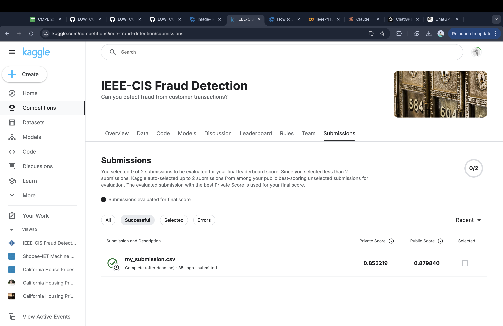

# Kaggle Competitions

This directory contains Jupyter notebooks for Kaggle competitions, demonstrating the use of AutoGluon in real-world machine learning challenges.

## Notebooks

1. `ieee_fraud_detection.ipynb`: This notebook is dedicated to the IEEE Fraud Detection competition on Kaggle. It covers:
   - Data exploration and preprocessing of transaction data
   - Feature engineering specific to fraud detection
   - Model training using AutoGluon for identifying fraudulent transactions
   - Evaluation and submission of results to the Kaggle competition

2. `california_housing_autogluon.ipynb`: This notebook focuses on the California Housing dataset, which is a popular dataset for regression tasks. It covers:
   - Data exploration and preprocessing of housing data
   - Feature engineering for housing sold price prediction
   - Model training using AutoGluon for predicting housing sold prices
   - Evaluation and analysis of model performance

## Video Walkthroughs

To help you understand the concepts and implementation details, we've prepared video walkthroughs for the notebooks:

1. IEEE Fraud Detection: [Video Walkthrough](https://drive.google.com/file/d/1EaA90Pu9TVCMDoM1NQzukobgUbgRBsSu/view?usp=sharing)

2. California Housing: [Video Walkthrough](https://drive.google.com/file/d/14qwBWkf9I9H74THYT_YiX1_9eb9Tr1nX/view?usp=sharing)

These video walkthroughs provide step-by-step explanations of the concepts and code in the notebooks.

## Getting Started

To use these notebooks:

1. Ensure you have AutoGluon installed, along with any additional dependencies required for the competitions.
2. Download the competition data from the Kaggle website and place it in an appropriate directory.
3. Open the notebooks in Jupyter Notebook or JupyterLab.
4. Follow the instructions within the notebooks to understand the problems, prepare the data, train models using AutoGluon, and generate predictions or submissions.
5. Watch the corresponding video walkthroughs for more detailed explanations of the notebooks.

## Kaggle Competition Participation

Remember to comply with Kaggle's rules and regulations when participating in competitions. Ensure that you understand the evaluation metrics and submission format specific to each competition.

For more information about the competitions, visit the official Kaggle competition pages.

Remember to check the main README of the repository for general setup instructions and prerequisites.

## Kaggle Profile

You can find more of my Kaggle work and competitions at my Kaggle profile:

[https://www.kaggle.com/jayasuryamurali](https://www.kaggle.com/jayasuryamurali)

